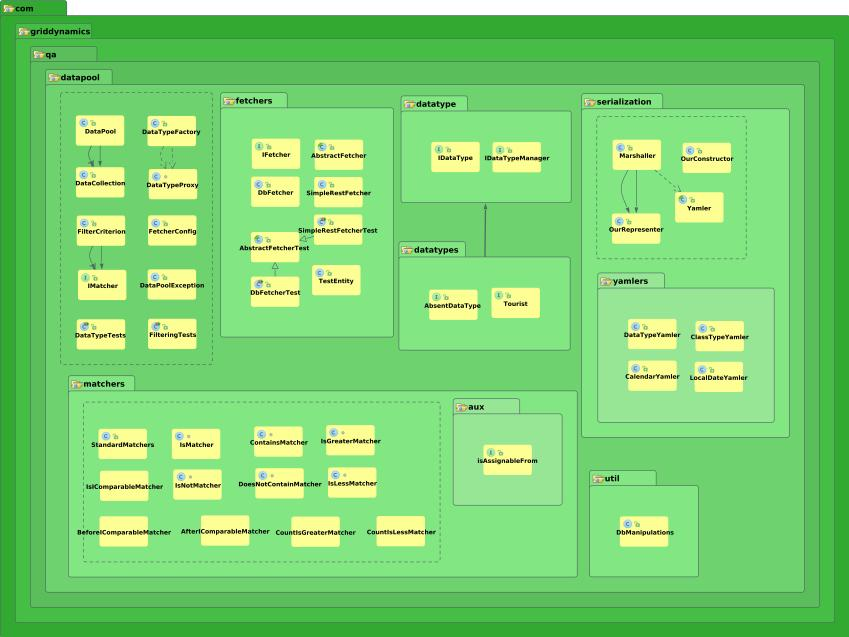

# Data Pool tool.
Data Pool is a configurable test automation supporting tool which fetches data from known data-sources and provides a way to query the data which is safe to be used by tests.

Current version: 1.0.0

## Purpose
 In a real world you need to run your automated tests against different environments (“dev”, “test”, “stage”, “pre-prod”, “prod” etc). Normally those environments point to different DBs thus data-sets may vary from endpoint to endpoint. At the same time, your tests need to know what to expect in each particular environment case. If you follow so called  “FullDB” approach your tests are being run against an application-under-test(AUT)'s instance pointing to a pre-populated DB or some other data-source and you do not have much control over that data. Somehow you need to ensure expected values correspond to actual data used by the AUT otherwise you will get false alarms due to “no-such-data” or “wrong-state-data” cases. Also your environments may not be completely ready (e.g. some services or third party components are absent or misconfigured). So a possible way is to run at least those tests which are able to pass on that environment while skipping all others. Another issue is coupling tests to test data, i.e. you need either "hard-code" several sets of data or copy-paste tests themselves.

Data Pool solves or significantly mitigates the issues outlined above by providing a single source of valid and available expected data for your tests.

## Features
* fetches data from known data-sources and stores it into the pool;
* provides a way to query the pool in order to get valid data which is safe to be used by tests;
* allows to filter fetched data to get those values only which are needed by concrete test;
* makes it possible to store and load fetched data;
* highly customizable, own fetchers, filter criteria, custom data-types are supported.

## Getting started

### Download
[](https://maven-badges.herokuapp.com/maven-central/com.griddynamics.qa.datapool/data-pool)

[Quick access via maven](http://search.maven.org/#artifactdetails|com.griddynamics.qa.datapool|data-pool|1.0.0|):
```
<dependency>
   <groupId>com.griddynamics.qa.datapool</groupId>
   <artifactId>data-pool</artifactId>
   <version>1.0.0</version>
 </dependency>
```

### Examples
Please have a look at _data-pool-examples_ project. It contains a set of ready-to-run examples like:

#### Fetching

* there are two simple fetchers by default: _DbFetcher_ and _SimpleRestFetcher_ ;
* you could create your own fetchers by extending _AbstractFetcher_ class or implementing _IFetcher_ interface;
* Data Pool uses data-type managers to fetch data. So you should provide corresponding managers which know from where to get data and how to build corresponding data-type instances. Managers shall implement _IDataTypeManager_ interface. See _com.griddynamics.qa.datapool.examples.dbfetcher.UserManager_ as an example.

For DB fetching example please see _com.griddynamics.qa.datapool.examples.dbfetcher.DbFetcherExample_ .
For REST Web Service fetching example please see _com.griddynamics.qa.datapool.examples.simplerestfetcher.SimpleRestFetcherExample_ .

#### Query and filtering

* there is a set of built-in matchers(IS_LESS, IS, etc). Have a look at _com.griddynamics.qa.datapool.matchers.StandardMatchers_ ;
* you could create your own matchers by implementing _IMatcher_ interface.

For Find&Filter example please see _com.griddynamics.qa.datapool.examples.find.FindExample_

#### Store&Load

* by default Data Pool supports some basic Java types upon storing/loading data;
* you could support you own types by extending _Yamler_ class.

For Find&Filter example please see _com.griddynamics.qa.datapool.examples.seriliazation.SerializationExample_

#### Usage by automated tests
For Cucumber based example please have a look at _/data-pool-examples/src/test/resources/com/griddynamics/qa/datapool/examples/cuke/datapool.feature_.

### Package view

